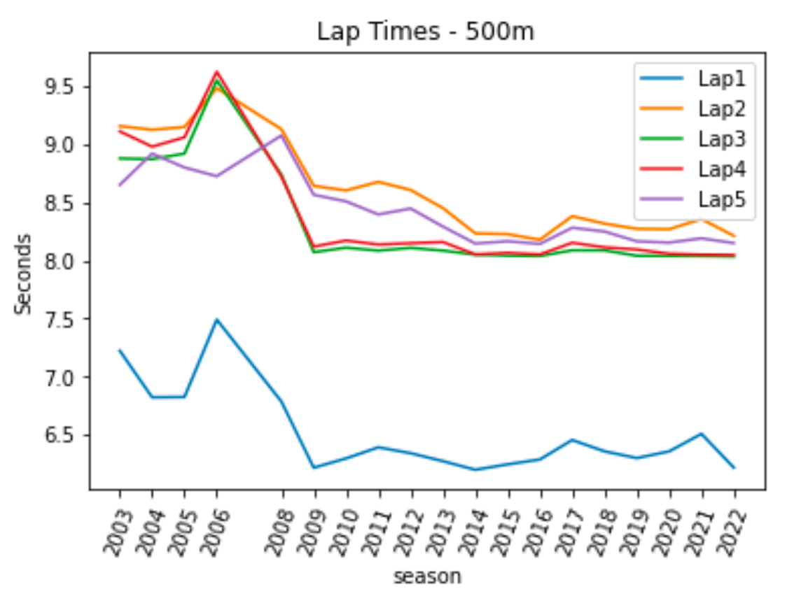
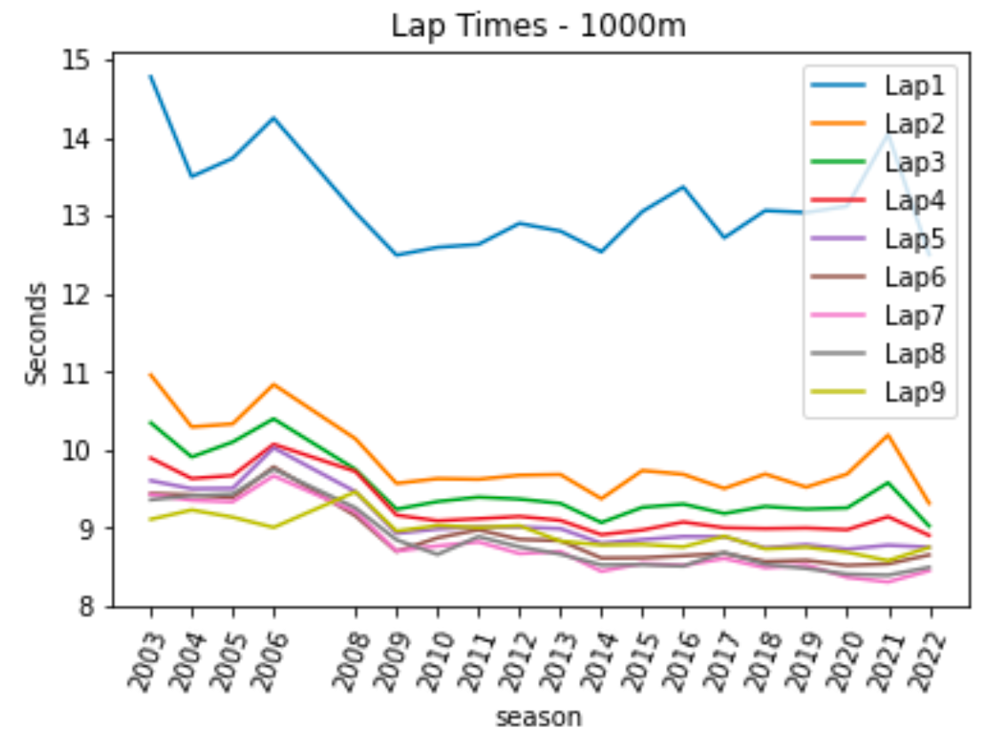
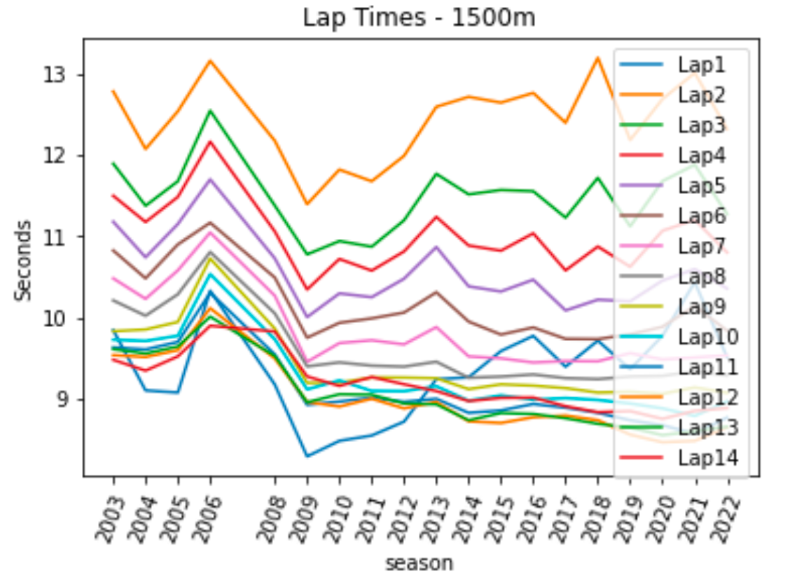
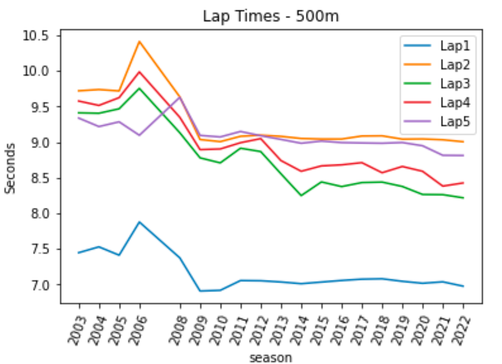
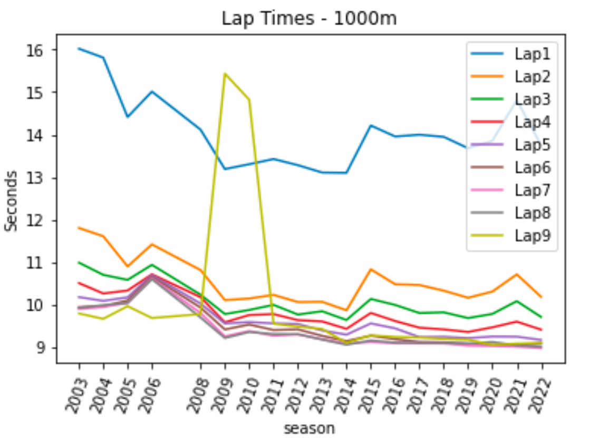
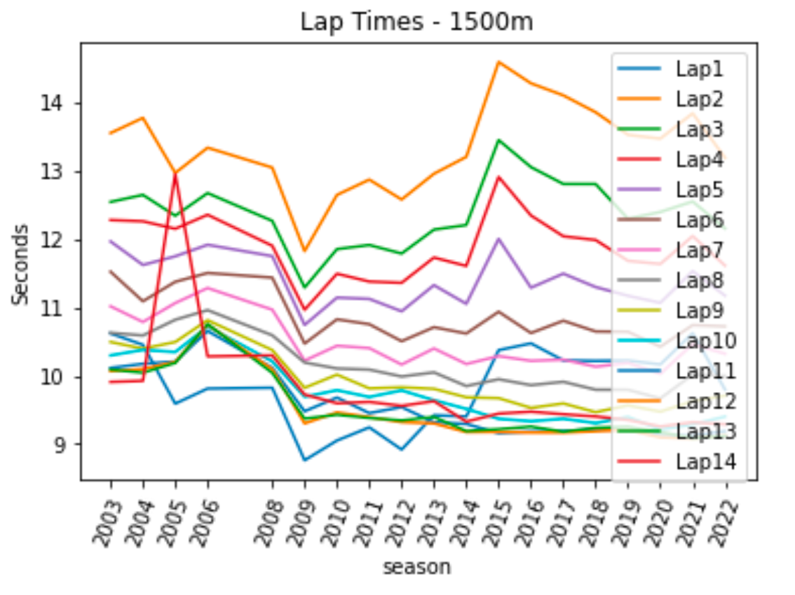

# Lap Times over Years for Winners

## Men
### 500m

| season | Lap 1 | Lap 2 | Lap 3 | Lap 4 | Lap 5 |
|---------:|--------:|--------:|--------:|--------:|--------:|
| 2003 | 7.22398 | 9.1557 | 8.87761 | 9.11048 | 8.65092 |
| 2004 | 6.82339 | 9.12487 | 8.87211 | 8.9793 | 8.91929 |
| 2005 | 6.82632 | 9.14796 | 8.91948 | 9.05916 | 8.80008 |
| 2006 | 7.49234 | 9.48175 | 9.54984 | 9.62332 | 8.72534 |
| 2008 | 6.78757 | 9.12923 | 8.73779 | 8.72257 | 9.07516 |
| 2009 | 6.21813 | 8.64214 | 8.07141 | 8.11951 | 8.56553 |
| 2010 | 6.29814 | 8.60298 | 8.11039 | 8.17184 | 8.50851 |
| 2011 | 6.39372 | 8.67589 | 8.08502 | 8.13791 | 8.39633 |
| 2012 | 6.34312 | 8.60703 | 8.10863 | 8.14919 | 8.44696 |
| 2013 | 6.27477 | 8.45054 | 8.08514 | 8.15909 | 8.2919 |
| 2014 | 6.20057 | 8.2337 | 8.05094 | 8.05254 | 8.14611 |
| 2015 | 6.24724 | 8.22656 | 8.04268 | 8.06559 | 8.16569 |
| 2016 | 6.28922 | 8.17898 | 8.03899 | 8.05223 | 8.14294 |
| 2017 | 6.45658 | 8.3814 | 8.08772 | 8.15268 | 8.28202 |
| 2018 | 6.35915 | 8.31762 | 8.08733 | 8.11363 | 8.24937 |
| 2019 | 6.3013 | 8.27281 | 8.04091 | 8.0947 | 8.1652 |
| 2020 | 6.35865 | 8.26936 | 8.04013 | 8.05814 | 8.15426 |
| 2021 | 6.50948 | 8.35691 | 8.03902 | 8.05039 | 8.19067 |
| 2022 | 6.21972 | 8.21229 | 8.03513 | 8.04706 | 8.15017 |

### 1000m

| season | Lap 1 | Lap 2 | Lap 3 | Lap 4 | Lap 5 | Lap 6 | Lap 7 | Lap 8 | Lap 9 |
|---------:|--------:|---------:|---------:|---------:|---------:|--------:|--------:|--------:|--------:|
| 2003 | 14.7803 | 10.9627 | 10.3491 | 9.89728 | 9.60803 | 9.4421 | 9.42883 | 9.36347 | 9.11259 |
| 2004 | 13.5025 | 10.2967 | 9.91098 | 9.63498 | 9.50445 | 9.42629 | 9.35691 | 9.41545 | 9.23226 |
| 2005 | 13.7376 | 10.3349 | 10.1029 | 9.67305 | 9.50921 | 9.3909 | 9.33652 | 9.43614 | 9.13996 |
| 2006 | 14.2536 | 10.8399 | 10.4004 | 10.0741 | 10.0284 | 9.78448 | 9.66953 | 9.75647 | 9.00855 |
| 2008 | 13.0399 | 10.1436 | 9.75146 | 9.72585 | 9.46504 | 9.1577 | 9.20919 | 9.25799 | 9.46595 |
| 2009 | 12.4965 | 9.57262 | 9.24204 | 9.16602 | 8.93187 | 8.7003 | 8.70589 | 8.84934 | 8.9623 |
| 2010 | 12.5967 | 9.63389 | 9.33994 | 9.09402 | 8.9888 | 8.87545 | 8.77142 | 8.66259 | 9.03257 |
| 2011 | 12.6342 | 9.62578 | 9.39672 | 9.11979 | 9.01384 | 8.97852 | 8.82303 | 8.89068 | 9.00888 |
| 2012 | 12.9035 | 9.67711 | 9.37162 | 9.14944 | 9.01327 | 8.85621 | 8.67433 | 8.75944 | 9.03051 |
| 2013 | 12.8049 | 9.68668 | 9.31666 | 9.09932 | 8.99289 | 8.8381 | 8.6998 | 8.66731 | 8.83311 |
| 2014 | 12.5387 | 9.37658 | 9.07098 | 8.91604 | 8.80673 | 8.6165 | 8.44676 | 8.52817 | 8.78374 |
| 2015 | 13.0557 | 9.73784 | 9.26597 | 8.97531 | 8.85302 | 8.62016 | 8.54886 | 8.53223 | 8.79129 |
| 2016 | 13.3694 | 9.689 | 9.30776 | 9.07802 | 8.89239 | 8.64609 | 8.52315 | 8.51384 | 8.7593 |
| 2017 | 12.719 | 9.50812 | 9.1872 | 9.00445 | 8.88852 | 8.67683 | 8.61097 | 8.68821 | 8.8956 |
| 2018 | 13.0675 | 9.69246 | 9.27809 | 8.99306 | 8.74704 | 8.57207 | 8.49345 | 8.53598 | 8.7338 |
| 2019 | 13.043 | 9.5245 | 9.24336 | 9.0011 | 8.78723 | 8.5864 | 8.5254 | 8.48365 | 8.75567 |
| 2020 | 13.1233 | 9.69192 | 9.25879 | 8.97935 | 8.73102 | 8.52282 | 8.36902 | 8.41023 | 8.69044 |
| 2021 | 14.0501 | 10.1932 | 9.58205 | 9.14678 | 8.78095 | 8.54249 | 8.31063 | 8.39698 | 8.58454 |
| 2022 | 12.5041 | 9.31841 | 9.02657 | 8.90696 | 8.75554 | 8.65605 | 8.45449 | 8.49736 | 8.75234 |

### 1500m

| season | Lap 1 | Lap 2 | Lap 3 | Lap 4 | Lap 5 | Lap 6 | Lap 7 | Lap 8 | Lap 9 | Lap 10 | Lap 11 | Lap 12 | Lap 13 | Lap 14 |
|---------:|---------:|--------:|--------:|--------:|--------:|---------:|---------:|---------:|---------:|---------:|---------:|---------:|---------:|---------:|
| 2003 | 9.84306 | 12.7903 | 11.8992 | 11.5022 | 11.1822 | 10.8266 | 10.4822 | 10.2104 | 9.83013 | 9.7255 | 9.62997 | 9.53486 | 9.60902 | 9.47747 |
| 2004 | 9.09934 | 12.0798 | 11.3791 | 11.1784 | 10.7423 | 10.4829 | 10.2301 | 10.0215 | 9.85172 | 9.71016 | 9.60516 | 9.51206 | 9.55447 | 9.34361 |
| 2005 | 9.07339 | 12.5458 | 11.6819 | 11.4883 | 11.154 | 10.9018 | 10.5819 | 10.2866 | 9.94459 | 9.77424 | 9.69801 | 9.59621 | 9.64094 | 9.51984 |
| 2006 | 10.3297 | 13.1692 | 12.5537 | 12.171 | 11.7045 | 11.1699 | 11.0489 | 10.8081 | 10.7275 | 10.5354 | 10.3049 | 10.1144 | 10.0105 | 9.89799 |
| 2008 | 9.17248 | 12.1814 | 11.3816 | 11.0621 | 10.7298 | 10.4926 | 10.2686 | 10.0505 | 9.86209 | 9.73109 | 9.54346 | 9.49396 | 9.52314 | 9.82666 |
| 2009 | 8.2849 | 11.3982 | 10.7787 | 10.3452 | 10.0046 | 9.74992 | 9.45188 | 9.39605 | 9.1925 | 9.11268 | 8.92205 | 8.95766 | 8.95308 | 9.2719 |
| 2010 | 8.47701 | 11.8251 | 10.9429 | 10.7221 | 10.2974 | 9.93406 | 9.68401 | 9.44538 | 9.19455 | 9.22283 | 8.96214 | 8.90039 | 9.05224 | 9.15512 |
| 2011 | 8.54265 | 11.6817 | 10.8736 | 10.5783 | 10.2505 | 9.98861 | 9.71858 | 9.40541 | 9.25979 | 9.09333 | 9.00731 | 8.997 | 9.04674 | 9.26426 |
| 2012 | 8.71433 | 11.9948 | 11.1989 | 10.815 | 10.4781 | 10.0603 | 9.66774 | 9.39315 | 9.25842 | 9.08942 | 8.95887 | 8.8776 | 8.93799 | 9.17558 |
| 2013 | 9.23738 | 12.6003 | 11.7735 | 11.2416 | 10.8689 | 10.3111 | 9.88118 | 9.45367 | 9.24982 | 9.15146 | 8.99551 | 8.9571 | 8.92819 | 9.09149 |
| 2014 | 9.26156 | 12.7236 | 11.5198 | 10.888 | 10.3841 | 9.94944 | 9.51901 | 9.2557 | 9.11533 | 8.97273 | 8.82256 | 8.71798 | 8.73098 | 8.968 |
| 2015 | 9.58541 | 12.6521 | 11.5738 | 10.8241 | 10.3208 | 9.7887 | 9.49555 | 9.27034 | 9.17448 | 9.03876 | 8.85245 | 8.69754 | 8.82007 | 9.00723 |
| 2016 | 9.773 | 12.7717 | 11.5588 | 11.0386 | 10.4661 | 9.87697 | 9.44434 | 9.29604 | 9.15867 | 8.9841 | 8.93185 | 8.76843 | 8.80884 | 9.01113 |
| 2017 | 9.39204 | 12.4031 | 11.2326 | 10.581 | 10.0867 | 9.73568 | 9.46215 | 9.25136 | 9.12768 | 9.00491 | 8.88639 | 8.78861 | 8.7563 | 8.90418 |
| 2018 | 9.71444 | 13.2049 | 11.7242 | 10.8757 | 10.2194 | 9.73306 | 9.45931 | 9.23928 | 9.07342 | 8.98168 | 8.82392 | 8.73182 | 8.68759 | 8.83037 |
| 2019 | 9.36137 | 12.1895 | 11.1246 | 10.6257 | 10.2001 | 9.79148 | 9.55919 | 9.27126 | 9.08258 | 8.93794 | 8.73082 | 8.55392 | 8.64071 | 8.84395 |
| 2020 | 9.77285 | 12.6965 | 11.6825 | 11.0701 | 10.4555 | 9.88485 | 9.48198 | 9.27904 | 9.05766 | 8.87812 | 8.66916 | 8.45979 | 8.54726 | 8.74902 |
| 2021 | 10.4356 | 13.0188 | 11.8852 | 11.2042 | 10.5972 | 10.1423 | 9.50597 | 9.33526 | 9.13603 | 8.78477 | 8.56713 | 8.47658 | 8.59629 | 8.8469 |
| 2022 | 9.5095 | 12.3262 | 11.2766 | 10.8022 | 10.3572 | 9.83693 | 9.53224 | 9.28246 | 9.07073 | 8.96352 | 8.76431 | 8.64455 | 8.65103 | 8.88096 |

### 3000m

| season | Lap 1 | Lap 2 | Lap 3 | Lap 4 | Lap 5 | Lap 6 | Lap 7 | Lap 8 | Lap 9 | Lap 10 | Lap 11 | Lap 12 | Lap 13 | Lap 14 | Lap 15 | Lap 16 | Lap 17 | Lap 18 | Lap 19 | Lap 20 | Lap 21 | Lap 22 | Lap 23 | Lap 24 | Lap 25 | Lap 26 | Lap 27 |
|---------:|--------:|--------:|---------:|---------:|---------:|---------:|--------:|---------:|--------:|---------:|---------:|---------:|---------:|---------:|---------:|---------:|---------:|---------:|---------:|---------:|---------:|---------:|---------:|---------:|---------:|---------:|---------:|
| 2003 | 18.17 | 12.2876 | 11.5374 | 11.5883 | 11.755 | 11.063 | 11.3925 | 11.6519 | 11.565 | 11.4991 | 11.8609 | 12.0984 | 11.8262 | 11.6824 | 11.4816 | 10.4388 | 10.2799 | 11.3999 | 11.2436 | 10.3767 | 10.0367 | 10.1505 | 9.91925 | 9.6285 | 9.425 | 9.285 | 9.2925 |
| 2004 | 17.2221 | 10.9609 | 11.1077 | 11.7204 | 12.3274 | 12.6456 | 12.2546 | 12.4171 | 12.4506 | 11.367 | 11.2715 | 10.8057 | 10.5921 | 10.6606 | 10.4703 | 10.2904 | 10.1783 | 10.226 | 10.1856 | 10.2816 | 10.1309 | 10.0971 | 9.59043 | 9.80457 | 9.70871 | 9.698 | 9.36086 |
| 2005 | 20.3155 | 13.9163 | 12.5875 | 11.6774 | 11.2779 | 10.8261 | 11.3719 | 11.3948 | 12.1124 | 12.4372 | 12.8317 | 12.7525 | 12.1919 | 12.0506 | 12.173 | 12.2411 | 11.9511 | 11.2792 | 10.8144 | 10.4148 | 10.2471 | 9.9405 | 9.81663 | 9.83863 | 9.70769 | 9.70087 | 9.86112 |
| 2006 | 20.5933 | 14.681 | 13.6395 | 12.6235 | 12.3313 | 12.5187 | 12.7315 | 14.4608 | 13.698 | 14.4138 | 14.4003 | 13.7732 | 12.7558 | 12.0432 | 12.8078 | 11.8467 | 12.0157 | 12.1698 | 11.6855 | 11.6798 | 10.518 | 11.0408 | 11.2742 | 9.988 | 9.87017 | 9.52683 | 8.55933 |
| 2008 | 19.597 | 12.5265 | 10.4285 | 10.215 | 10.243 | 11.321 | 11.233 | 12.5715 | 9.97 | 10.34 | 12.1095 | 12.497 | 12.1595 | 11.819 | 12.214 | 11.5585 | 11.5375 | 11.1345 | 10.7885 | 10.321 | 9.856 | 9.5575 | 9.6965 | 9.842 | 9.3835 | 9.752 | 10.2905 |
| 2012 | 16.099 | 12.079 | 9.026 | 9.001 | 9.051 | 9.092 | 9.005 | 9.012 | 9.026 | 11.048 | 10.014 | 9.088 | 10.024 | 10.039 | 10.039 | 10.073 | 10.078 | 10.022 | 10.058 | 10.043 | 10.03 | 10.035 | 10.062 | 10.059 | 10.049 | 9.096 | 9.094 |
| 2013 | 17.024 | 10.078 | 10.045 | 9.091 | 9.071 | 9.026 | 9.046 | 9.035 | 9.03 | 9.064 | 12.067 | 11.09 | 12.056 | 13.043 | 13.05 | 13.077 | 13.034 | 12.086 | 12.017 | 11.004 | 10.048 | 10.005 | 9.066 | 9.056 | 9.028 | 8.093 | 9.002 |
| 2015 | 16.3785 | 10.058 | 9.21083 | 9.21517 | 9.70517 | 9.87967 | 10.3932 | 9.88333 | 10.5332 | 11.0445 | 10.7312 | 11.0493 | 11.2217 | 11.3577 | 11.2118 | 11.0582 | 11.0533 | 10.7068 | 10.2305 | 10.219 | 10.04 | 9.7265 | 9.55733 | 9.39883 | 9.85633 | 9.884 | 10.3807 |

## Women
### 500m

| season | Lap 1 | Lap 2 | Lap 3 | Lap 4 | Lap 5 |
|---------:|--------:|---------:|--------:|--------:|--------:|
| 2003 | 7.44588 | 9.72041 | 9.41098 | 9.5767 | 9.33748 |
| 2004 | 7.52777 | 9.73827 | 9.405 | 9.51522 | 9.21819 |
| 2005 | 7.41074 | 9.71848 | 9.46806 | 9.6246 | 9.28467 |
| 2006 | 7.87684 | 10.4138 | 9.75478 | 9.9867 | 9.09586 |
| 2008 | 7.37299 | 9.63455 | 9.13109 | 9.34808 | 9.62928 |
| 2009 | 6.90738 | 9.03574 | 8.77855 | 8.89418 | 9.09406 |
| 2010 | 6.91693 | 9.00634 | 8.70779 | 8.90337 | 9.07234 
| 2011 | 7.05435 | 9.0814 | 8.91374 | 8.99112 | 9.14903 |
| 2012 | 7.05145 | 9.09721 | 8.86669 | 9.04889 | 9.08973 |
| 2013 | 7.0342 | 9.08057 | 8.55435 | 8.7404 | 9.03784 |
| 2014 | 7.01034 | 9.05049 | 8.24795 | 8.58999 | 8.98359 |
| 2015 | 7.03309 | 9.04307 | 8.44016 | 8.66562 | 9.01424 |
| 2016 | 7.0557 | 9.04283 | 8.37473 | 8.68014 | 8.9929 |
| 2017 | 7.07379 | 9.0854 | 8.43127 | 8.71101 | 8.98768 |
| 2018 | 7.07909 | 9.08789 | 8.43807 | 8.56943 | 8.98364 |
| 2019 | 7.04368 | 9.04145 | 8.37637 | 8.65727 | 8.99363 |
| 2020 | 7.01619 | 9.04405 | 8.26401 | 8.58983 | 8.94851 |
| 2021 | 7.03626 | 9.03266 | 8.26131 | 8.38117 | 8.81426 |
| 2022 | 6.97589 | 9.00506 | 8.21724 | 8.42541 | 8.8119 |

### 1000m

!
| season | Lap 1 | Lap 2 | Lap 3 | Lap 4 | Lap 5 | Lap 6 | Lap 7 | Lap 8 | Lap 9 |
|---------:|--------:|---------:|---------:|---------:|---------:|---------:|---------:|---------:|---------:|
| 2003 | 16.0202 | 11.8009 | 10.9854 | 10.5041 | 10.174 | 9.93735 | 9.89322 | 9.92206 | 9.78938 |
| 2004 | 15.8106 | 11.6071 | 10.6977 | 10.2588 | 10.0852 | 9.95769 | 9.94027 | 9.98544 | 9.66274 |
| 2005 | 14.4115 | 10.8954 | 10.5792 | 10.3292 | 10.1691 | 10.0945 | 10.0406 | 10.0346 | 9.96061 |
| 2006 | 15.0113 | 11.4147 | 10.9334 | 10.7119 | 10.6948 | 10.6532 | 10.6197 | 10.5971 | 9.68205 |
| 2008 | 14.1158 | 10.8101 | 10.2311 | 10.1718 | 10.0221 | 9.92639 | 9.79938 | 9.69428 | 9.77358 |
| 2009 | 13.1873 | 10.1048 | 9.77511 | 9.58015 | 9.55402 | 9.41174 | 9.24918 | 9.21171 | 15.4354 |
| 2010 | 13.302 | 10.1408 | 9.87113 | 9.75249 | 9.58598 | 9.52801 | 9.37683 | 9.35379 | 14.8204 |
| 2011 | 13.4237 | 10.2261 | 9.99126 | 9.77411 | 9.55637 | 9.39975 | 9.26226 | 9.30425 | 9.54658 |
| 2012 | 13.28 | 10.0587 | 9.76328 | 9.63183 | 9.54224 | 9.41467 | 9.29412 | 9.30233 | 9.4827 |
| 2013 | 13.1057 | 10.0637 | 9.8414 | 9.60151 | 9.3896 | 9.26192 | 9.18445 | 9.17344 | 9.42497 |
| 2014 | 13.099 | 9.86399 | 9.63449 | 9.42686 | 9.28981 | 9.13927 | 9.08159 | 9.05398 | 9.09725 |
| 2015 | 14.2131 | 10.8282 | 10.1305 | 9.80122 | 9.55485 | 9.26617 | 9.11813 | 9.15315 | 9.2754 |
| 2016 | 13.9541 | 10.4769 | 9.9895 | 9.61112 | 9.43865 | 9.1844 | 9.08649 | 9.10296 | 9.23703 |
| 2017 | 13.9966 | 10.4591 | 9.79918 | 9.45393 | 9.23252 | 9.12008 | 9.08469 | 9.09321 | 9.22374 
| 2018 | 13.9455 | 10.3251 | 9.81514 | 9.41385 | 9.24018 | 9.11073 | 9.08327 | 9.09279 | 9.19058 |
| 2019 | 13.678 | 10.1587 | 9.68026 | 9.35346 | 9.20853 | 9.07566 | 9.03194 | 9.08413 | 9.1739 |
| 2020 | 13.8534 | 10.3049 | 9.77868 | 9.46305 | 9.24679 | 9.04959 | 9.02388 | 9.11709 | 9.04729 |
| 2021 | 14.8115 | 10.7093 | 10.0786 | 9.59706 | 9.24283 | 9.04423 | 9.00774 | 9.03926 | 9.07989 |
| 2022 | 13.7499 | 10.1803 | 9.70688 | 9.40883 | 9.16682 | 9.08318 | 8.97187 | 9.0109 | 9.09782 |

### 1500m

| season | Lap 1 | Lap 2 | Lap 3 | Lap 4 | Lap 5 | Lap 6 | Lap 7 | Lap 8 | Lap 9 | Lap 10 | Lap 11 | Lap 12 | Lap 13 | Lap 14 |
|---------:|---------:|--------:|--------:|--------:|--------:|--------:|--------:|---------:|---------:|---------:|---------:|---------:|---------:|---------:|
| 2003 | 10.6216 | 13.5602 | 12.5502 | 12.2842 | 11.9703 | 11.5258 | 11.0195 | 10.6299 | 10.4963 | 10.2996 | 10.1158 | 10.0685 | 10.091 | 9.91043 |
| 2004 | 10.4546 | 13.7823 | 12.6534 | 12.266 | 11.6256 | 11.0934 | 10.7895 | 10.5915 | 10.3977 | 10.3804 | 10.1756 | 10.0996 | 10.046 | 9.92644 |
| 2005 | 9.59165 | 12.9748 | 12.3479 | 12.1564 | 11.7525 | 11.3787 | 11.067 | 10.8223 | 10.4962 | 10.3492 | 10.2088 | 10.2029 | 10.189 | 12.9594 |
| 2006 | 9.81299 | 13.3451 | 12.6797 | 12.3619 | 11.9216 | 11.5079 | 11.2869 | 10.9629 | 10.8158 | 10.7237 | 10.6567 | 10.7505 | 10.7595 | 10.2849 |
| 2008 | 9.825 | 13.0538 | 12.2722 | 11.9072 | 11.755 | 11.4402 | 10.9701 | 10.5945 | 10.3775 | 10.2123 | 10.1169 | 10.0953 | 10.0431 | 10.2995 |
| 2009 | 8.76105 | 11.8292 | 11.2943 | 10.968 | 10.7459 | 10.4729 | 10.2226 | 10.1947 | 9.82389 | 9.69146 | 9.47968 | 9.30182 | 9.37179 | 9.72503 |
| 2010 | 9.0507 | 12.6525 | 11.8581 | 11.4969 | 11.1465 | 10.8281 | 10.4406 | 10.1072 | 10.0174 | 9.78866 | 9.68132 | 9.46247 | 9.4293 | 9.59705 |
| 2011 | 9.24374 | 12.8771 | 11.9182 | 11.3822 | 11.1279 | 10.7567 | 10.4061 | 10.0907 | 9.81538 | 9.68983 | 9.45288 | 9.39447 | 9.38205 | 9.61717 |
| 2012 | 8.91888 | 12.5855 | 11.7932 | 11.3639 | 10.946 | 10.5072 | 10.165 | 9.98982 | 9.83199 | 9.78528 | 9.54138 | 9.32017 | 9.34471 | 9.55919 |
| 2013 | 9.42185 | 12.9634 | 12.1441 | 11.7342 | 11.3293 | 10.7126 | 10.4009 | 10.0498 | 9.809 | 9.64222 | 9.31735 | 9.30195 | 9.39611 | 9.6282 |
| 2014 | 9.40292 | 13.2112 | 12.2112 | 11.6115 | 11.056 | 10.6206 | 10.1734 | 9.85018 | 9.68504 | 9.5149 | 9.29418 | 9.17506 | 9.18951 | 9.32779 |
| 2015 | 10.3764 | 14.6019 | 13.4569 | 12.9162 | 12.0082 | 10.9394 | 10.2892 | 9.94966 | 9.67237 | 9.3692 | 9.15944 | 9.17827 | 9.21697 | 9.44582 |
| 2016 | 10.4756 | 14.2893 | 13.0605 | 12.3513 | 11.2923 | 10.6276 | 10.2199 | 9.86321 | 9.52984 | 9.33374 | 9.18329 | 9.16866 | 9.25471 | 9.47392 |
| 2017 | 10.226 | 14.113 | 12.8133 | 12.0462 | 11.4981 | 10.8075 | 10.2371 | 9.91201 | 9.59454 | 9.37003 | 9.18974 | 9.16738 | 9.17987 | 9.43657 |
| 2018 | 10.2186 | 13.8649 | 12.8123 | 11.9915 | 11.3014 | 10.6503 | 10.1345 | 9.79639 | 9.46643 | 9.30675 | 9.21433 | 9.18706 | 9.23684 | 9.40355 |
| 2019 | 10.2239 | 13.5341 | 12.3025 | 11.6862 | 11.1732 | 10.6458 | 10.1886 | 9.79474 | 9.56607 | 9.39658 | 9.20268 | 9.20762 | 9.25043 | 9.35374 |
| 2020 | 10.1665 | 13.4778 | 12.4024 | 11.64 | 11.0704 | 10.4262 | 10.0291 | 9.66813 | 9.47438 | 9.21118 | 9.13254 | 9.09636 | 9.17576 | 9.25633 |
| 2021 | 10.625 | 13.8492 | 12.5563 | 12.0487 | 11.5356 | 10.7436 | 10.4657 | 10.0177 | 9.62785 | 9.28619 | 9.12269 | 9.08215 | 9.084 | 9.31823 |
| 2022 | 9.79936 | 13.1976 | 12.1611 | 11.6165 | 11.1754 | 10.7252 | 10.3237 | 10.0018 | 9.70786 | 9.40165 | 9.18812 | 9.12132 | 9.11709 | 9.28909 |

### 3000m
| season | Lap 1 | Lap 2 | Lap 3 | Lap 4 | Lap 5 | Lap 6 | Lap 7 | Lap 8 | Lap 9 | Lap 10 | Lap 11 | Lap 12 | Lap 13 | Lap 14 | Lap 15 | Lap 16 | Lap 17 | Lap 18 | Lap 19 | Lap 20 | Lap 21 | Lap 22 | Lap 23 | Lap 24 | Lap 25 | Lap 26 | Lap 27 |
|---------:|--------:|--------:|--------:|--------:|--------:|--------:|--------:|--------:|--------:|---------:|---------:|---------:|---------:|---------:|---------:|---------:|---------:|---------:|---------:|---------:|---------:|---------:|---------:|---------:|---------:|---------:|---------:|
| 2003 | 21.3619 | 13.793 | 13.5573 | 13.5829 | 13.3901 | 14.5174 | 13.3654 | 12.238 | 12.8484 | 14.6393 | 13.863 | 13.5114 | 13.7004 | 13.56 | 13.0224 | 12.5666 | 12.9207 | 12.7956 | 11.8254 | 10.825 | 10.2304 | 10.0699 | 9.92543 | 9.82386 | 9.68786 | 9.74957 | 9.614 |
| 2004 | 22.5315 | 14.0126 | 13.1879 | 13.5084 | 13.5411 | 13.4051 | 13.2644 | 12.8042 | 13.2142 | 14.1141 | 14.441 | 14.3061 | 14.1926 | 13.7096 | 13.213 | 13.2006 | 12.4326 | 11.6086 | 11.2195 | 10.8284 | 10.3565 | 10.1364 | 9.9505 | 9.746 | 9.64762 | 9.48513 | 9.421 |
| 2005 | 21.3245 | 13.8287 | 13.7689 | 13.1361 | 12.689 | 13.1017 | 12.5293 | 12.4627 | 12.6141 | 12.2324 | 11.7943 | 12.0734 | 11.6951 | 11.4263 | 11.4437 | 11.3179 | 11.433 | 11.3853 | 11.5454 | 11.0197 | 10.8761 | 10.5268 | 10.5333 | 10.4656 | 10.2862 | 10.2788 | 10.1174 |
| 2006 | 22.0638 | 16.5553 | 13.8423 | 13.8665 | 13.073 | 12.5108 | 13.4982 | 13.812 | 13.912 | 15.1757 | 15.1078 | 14.5422 | 14.532 | 14.4057 | 14.8457 | 12.5735 | 13.3493 | 11.6297 | 11.186 | 11.9778 | 11.984 | 11.7945 | 10.747 | 11.2992 | 10.7367 | 10.3913 | 9.5435 |
| 2008 | 22.702 | 16.759 | 16.174 | 15.951 | 15.365 | 14.663 | 12.896 | 14.039 | 14.142 | 14.661 | 14.541 | 14.392 | 14.277 | 13.689 | 11.448 | 10.052 | 9.569 | 9.703 | 10.142 | 10.249 | 10.232 | 10.854 | 10.346 | 9.38 | 9.774 | 9.924 | 9.866 |
| 2012 | 18.045 | 13.031 | 13.015 | 13.026 | 12.053 | 10.029 | 8.09 | 9.009 | 9.081 | 11.095 | 12.018 | 13.097 | 14.016 | 13.075 | 12.042 | 12.099 | 13.005 | 11.046 | 11.009 | 10.09 | 10.031 | 9.08 | 9.09 | 9.04 | 9.027 | 9.027 | 9.071 |
| 2013 | 24.029 | 20.068 | 18.005 | 18.044 | 17.002 | 13.054 | 9.093 | 9.053 | 10.008 | 11.063 | 17.075 | 21.013 | 21.024 | 16.032 | 14.009 | 13.096 | 13.068 | 11.033 | 11.052 | 10.044 | 10.02 | 10.015 | 9.083 | 9.035 | 9.044 | 9.051 | 9.086 |
| 2015 | 23.4366 | 18.8552 | 17.6612 | 17.2356 | 15.244 | 13.8556 | 13.2404 | 13.665 | 14.242 | 14.6396 | 15.0494 | 15.0304 | 14.6488 | 13.853 | 12.24 | 11.438 | 11.4346 | 10.8392 | 10.4384 | 10.4304 | 9.8426 | 9.6474 | 9.2684 | 9.2566 | 9.264 | 9.258 | 9.2728 |