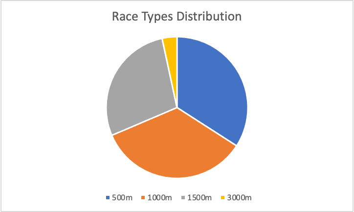
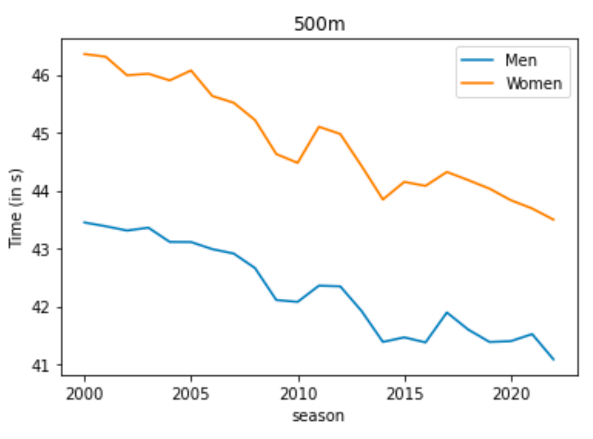
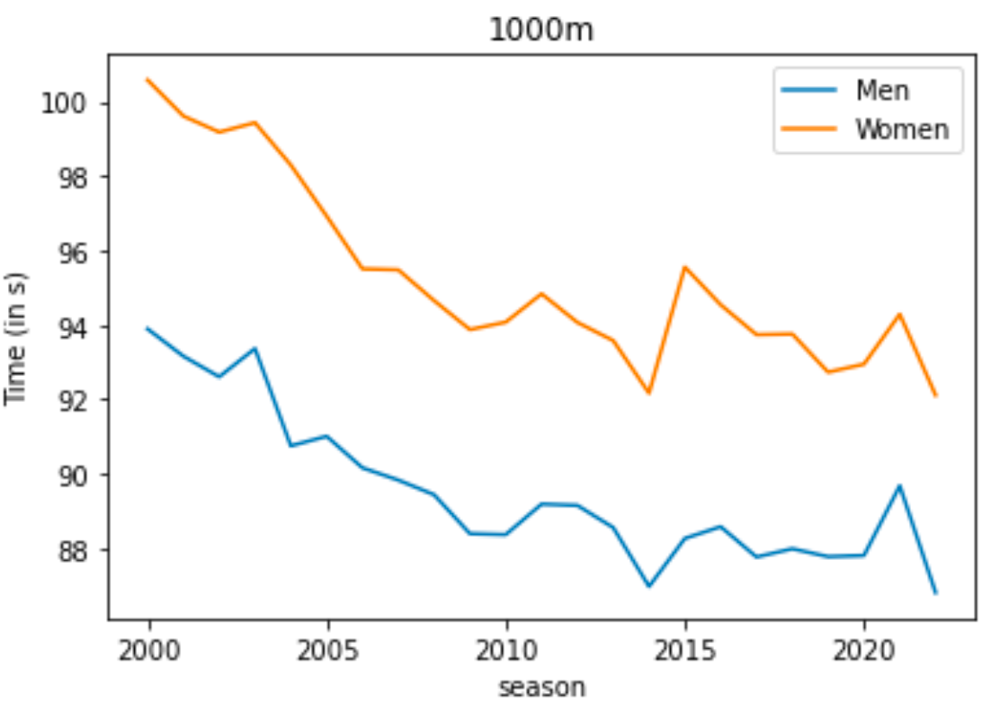
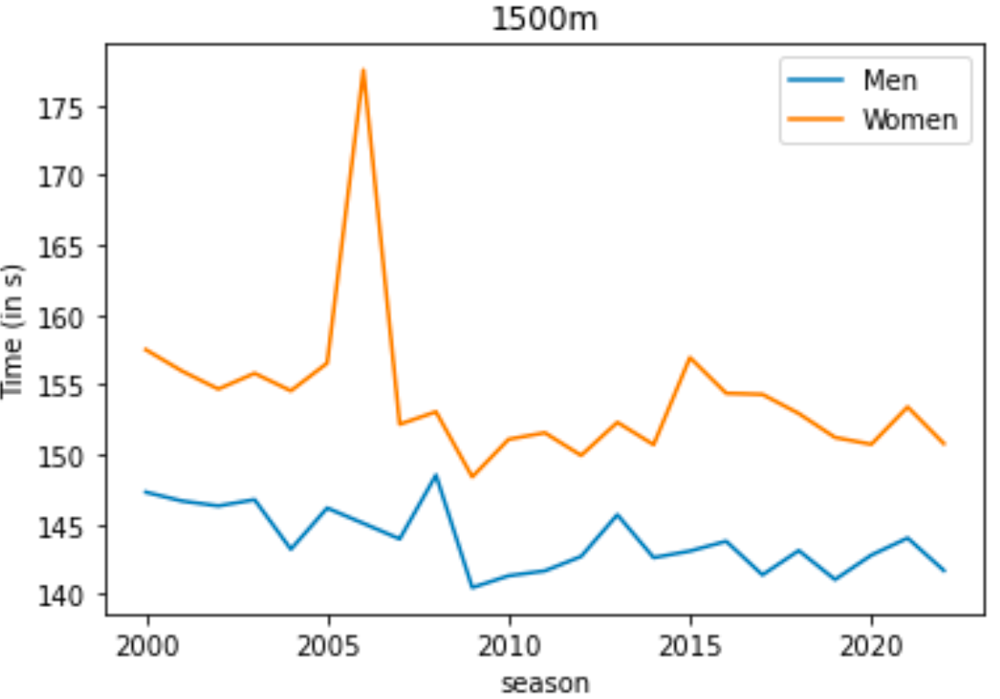
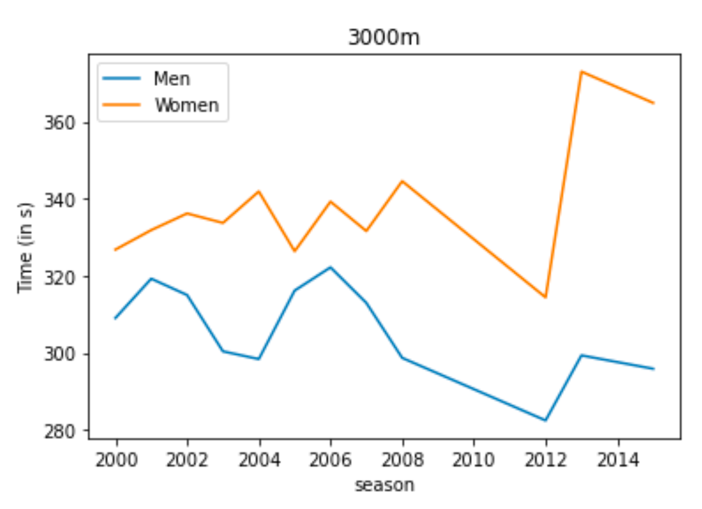

# Overall Statistics

## High-level Statistics

Total Skaters = 2101

Male Skaters = 1206 (57.4%)

Female Skaters = 895 (42.5%)

Competitions = 203

Number of Races

Total Races = 2015

500m = 687 (34.09%)

1000m = 695 (34.49%)

1500m = 565 (28.03%)

3000m = 68 (3.37%)

## Race Times

### Men
| season | 500m | 1000m | 1500m | 3000m |
|---------:|--------:|--------:|--------:|--------:|
| 2000 | 43.4491 | 93.8985 | 147.303 | 309.011 |
| 2001 | 43.3838 | 93.165 | 146.669 | 319.22 |
| 2002 | 43.3093 | 92.6109 | 146.32 | 314.984 |
| 2003 | 43.359 | 93.3699 | 146.764 | 300.361 |
| 2004 | 43.1135 | 90.7559 | 143.216 | 298.352 |
| 2005 | 43.1109 | 91.0128 | 146.169 | 316.136 |
| 2006 | 42.9881 | 90.1653 | 145.069 | 322.168 |
| 2007 | 42.9131 | 89.836 | 143.956 | 312.935 |
| 2008 | 42.6625 | 89.4433 | 148.525 | 298.663 |
| 2009 | 42.1104 | 88.396 | 140.472 | nan |
| 2010 | 42.078 | 88.3702 | 141.318 | nan |
| 2011 | 42.3583 | 89.1905 | 141.67 | nan |
| 2012 | 42.3465 | 89.1561 | 142.701 | 282.417 |
| 2013 | 41.9204 | 88.5607 | 145.688 | 299.312 |
| 2014 | 41.3866 | 86.9772 | 142.616 | nan |
| 2015 | 41.4657 | 88.2682 | 143.089 | 295.842 |
| 2016 | 41.3782 | 88.5842 | 143.792 | nan |
| 2017 | 41.8955 | 87.7694 | 141.382 | nan |
| 2018 | 41.6003 | 87.9905 | 143.124 | nan |
| 2019 | 41.3858 | 87.7793 | 141.048 | nan |
| 2020 | 41.4006 | 87.8086 | 142.798 | nan |
| 2021 | 41.5221 | 89.6842 | 144.022 | nan |
| 2022 | 41.0856 | 86.8149 | 141.697 | nan |

### Women
| season | 500m | 1000m | 1500m | 3000m |
|---------:|--------:|---------:|--------:|--------:|
| 2000 | 46.3559 | 100.586 | 157.502 | 326.778 |
| 2001 | 46.31 | 99.6174 | 155.967 | 331.843 |
| 2002 | 45.9898 | 99.1852 | 154.681 | 336.163 |
| 2003 | 46.0164 | 99.4379 | 155.808 | 333.705 |
| 2004 | 45.9012 | 98.301 | 154.556 | 341.875 |
| 2005 | 46.0729 | 96.9282 | 156.534 | 326.347 |
| 2006 | 45.6323 | 95.5109 | 177.52 | 339.235 |
| 2007 | 45.5161 | 95.4854 | 152.161 | 331.595 |
| 2008 | 45.2181 | 94.6581 | 153.053 | 344.546 |
| 2009 | 44.6303 | 93.8794 | 148.394 | nan |
| 2010 | 44.4776 | 94.08 | 151.085 | nan |
| 2011 | 45.1017 | 94.8397 | 151.552 | nan |
| 2012 | 44.9766 | 94.0728 | 149.933 | 314.367 |
| 2013 | 44.4236 | 93.5848 | 152.299 | 372.987 |
| 2014 | 43.8458 | 92.1727 | 150.701 | nan |
| 2015 | 44.1491 | 95.5611 | 156.934 | 364.867 |
| 2016 | 44.0807 | 94.5458 | 154.376 | nan |
| 2017 | 44.3212 | 93.7432 | 154.3 | nan |
| 2018 | 44.1807 | 93.76 | 152.933 | nan |
| 2019 | 44.0329 | 92.7364 | 151.217 | nan |
| 2020 | 43.8332 | 92.9503 | 150.726 | nan |
| 2021 | 43.6902 | 94.2925 | 153.401 | nan |
| 2022 | 43.4979 | 92.1179 | 150.775 | nan |

